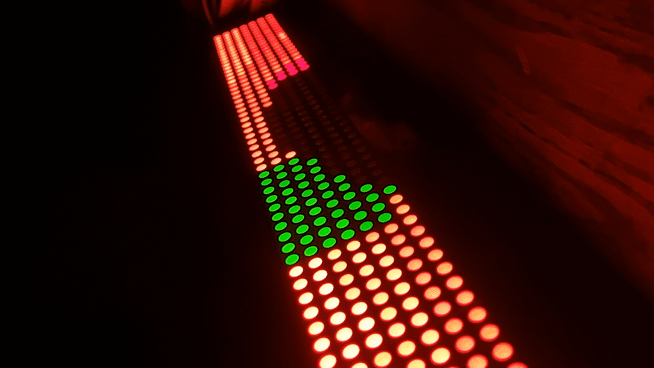

# 80x7 LED Display — RP2040 driver



Salvaged 16-module bi-colour (red/green) 5×7 LED dot-matrix display, 80×7
pixels, originally driven by an NXP LPC1768 on a plug-in daughterboard. The
daughterboard has been removed. An RP2040-Zero (clone) now drives the panel
electronics directly, through a 74HCT245 level shifter.

**Status:** fully working. It shows four colours with per-pixel control,
blanking, and four brightness levels per pixel. The display is driven by a
PIO shift driver, and animations are generated by an OCaml tool.

This file holds only what is currently true. The full bring-up history,
including every disproved theory and the evidence behind each finding, is in
[`debug_log.md`](debug_log.md).

## Panel hardware

- **16 identical 5×7 bi-colour modules** in one line on a single long PCB.
- **Per module:** `74HC595D` shift register (cascaded into the column chain),
  `74HC245D` bus buffer, `APM4953` dual P-ch MOSFET row drivers, and `HR1`–`HR7`
  resistor networks. Row addresses are decoded by a '138.
- **Module pins** (silkscreen on the back of each module):
  ```
  Row 1: G1  R1  G2  G3  H4  H2  H1  H3  R5
  Row 2: NL  H5  R2  H7  H6  R3  R4  G4  G5
  ```
  H1–H7 are the row commons, R1–R5 and G1–G5 are the column drives, and NL is
  a mechanical keying pin. Amber is just R and G lit together; there is no
  third die.
- **Power:** the panel is fed 5V at its **JP1** terminal block. Supply is a fixed
  5V; there is no current-limited bench supply.
- **Logic is 74HC, not HCT.** The input threshold is ~3.5V at 5V, so 3.3V GPIO
  can't reliably drive it. **A level shifter is mandatory.**

## Connector pinout (20-pin IDC)

**Signals are on the odd pins. Even pins are GND or +5V.**

| IDC | Signal |
|-----|--------|
| 1  | SRCLK |
| 2, 4, 6, 8 | GND |
| 3  | RCLK (latch) |
| **5**  | **GREEN data** |
| **7**  | **RED data** |
| 9  | OE |
| 10, 12, 14 | +5V |
| 11 | A0 |
| 13 | A1 |
| 15 | A2 |
| 16–20 | not yet mapped (probably GND) |

## Wiring: RP2040-Zero → 74HCT245 → panel

GP4–GP11 run contiguously into the 245's A1–A8. All pin numbers are package
pins on the 74HCT245 unless the column says otherwise.

| Signal | Zero pad | firmware macro | 245 A-side (in) | 245 B-side (out) | Panel IDC |
|--------|----------|----------------|-----------------|------------------|-----------|
| SRCLK  | GP4  | `PIN_SRCLK` | A1 — pin 2 | B1 — pin 18 | 1 |
| RCLK   | GP5  | `PIN_RCLK`  | A2 — pin 3 | B2 — pin 17 | 3 |
| G data | GP6  | `PIN_G`     | A3 — pin 4 | B3 — pin 16 | **5** |
| R data | GP7  | `PIN_R`     | A4 — pin 5 | B4 — pin 15 | **7** |
| OE     | GP8  | `PIN_OE`    | A5 — pin 6 | B5 — pin 14 | 9 |
| A0     | GP9  | `PIN_ADDR0` | A6 — pin 7 | B6 — pin 13 | 11 |
| A1     | GP10 | `PIN_ADDR1` | A7 — pin 8 | B7 — pin 12 | 13 |
| A2     | GP11 | `PIN_ADDR2` | A8 — pin 9 | B8 — pin 11 | 15 |
| GND    | GND  | —           | pin 10     | —                | 2 |

- **The B-side runs backwards** (B1 = pin 18 … B8 = pin 11), so the wiring
  crosses over rather than running straight across the package.
- **G and R must stay on consecutive GPIOs** (G = GP6, R = GP7). The PIO driver
  sets both with one `out pins, 2` instruction.
- **245 fixed pins:** pin 1 (DIR) → 5V, tied hard, never floating. Pin 19 (/OE) →
  GND. Pin 20 (VCC) → 5V. Pin 10 → GND. Ground is common between the Zero, the
  245 and the panel supply.
- **Decoupling:** 100nF X7R/X5R ceramic across pins 20 and 10, at the package,
  with short leads. Optionally add 10–100µF bulk at the panel's 5V entry.
- **Socket the 245** rather than soldering it. Two 74HCT244s are on hand as
  spares; they work, but their interleaved banks are more awkward to wire.

### Other GPIOs

| GPIO | Use |
|------|-----|
| GP12 | `PIN_HEARTBEAT`, a toggle for logic-analyzer captures. Drives nothing. |
| GP16 | Onboard WS2812 status LED (pio0 SM0) |
| GP2, GP3 | Not connected |

## Target board: RP2040-Zero (V1083 clone)

The RP2040 is the chip; the "Pico" is Raspberry Pi's own board. This one is a
clone of Waveshare's **RP2040-Zero**: smaller, with **2MB flash** (not 4MB), and
its pads are labelled with GP numbers directly.

- `platformio.ini`: `board = waveshare_rp2040_zero` and
  `board_build.core = earlephilhower` on the maxgerhardt platform. This is the
  same toolchain as the MIDI clock project.
- **There is no `LED_BUILTIN`.** The onboard LED is a WS2812 on GP16, driven by
  PIO. A dark LED therefore does *not* mean the firmware isn't running.
- **WS2812 status colours:**
  - solid blue: booted (and replay mode)
  - green blink at 1Hz: loop running
  - magenta: pin-map mode
  - amber: diagnostic mode
  - flashing red: slow-scan safety timeout
- **Keep the boards labelled.** An identical Zero is in service as a CMSIS-DAP
  debug probe (GP2 = SWCLK, GP3 = SWDIO, GP4/5 = UART). The two are physically
  indistinguishable.

Flash: hold BOOTSEL, plug in, then

```
pio run
cp .pio/build/rp2040zero/firmware.uf2 /media/rich/RPI-RP2/
```

Serial monitor: `pio device monitor -b 115200`.

## Firmware (`src/main.cpp`)

`#define MODE` selects the mode: `MODE_RUN` (normal), `MODE_PINMAP` (DMM pin
check), `MODE_DIAG` (signal-identification tests) or `MODE_REPLAY` (clocks out a
frame captured from the original controller). The build fails if the setting
is inconsistent.

### Colour table

**Both data lines are ACTIVE-LOW** (`RED_ACTIVE_LOW 1`, `GREEN_ACTIVE_LOW 1`).

| colour | red line | green line |
|--------|----------|------------|
| dark   | OFF (1)  | OFF (1)    |
| red    | ON  (0)  | OFF (1)    |
| green  | OFF (1)  | ON  (0)    |
| amber  | ON  (0)  | ON  (0)    |

### Geometry: inverted on all three axes

- Buffer row 0 is at the **bottom** of the panel, so use `NUM_ROWS-1-row`.
- Column 0 within a module is on the **right**, so read glyph bits with
  `(1 << col)`, not `(0x10 >> col)`.
- Module numbering runs **right-to-left**.

`renderFrame()` applies all three, so animation frames can be authored the
way they look.

### Driver structure

- **OE is ACTIVE-HIGH.** `PIN_OE` HIGH enables, LOW blanks.
- **Shift while blanked:** call `setOE(false)` and then shift, never the
  reverse. With the bit-banged driver, shifting took ~400µs of every slot against an 8µs
  lit window. Shifting with OE LOW drew 0.143A and stayed cool; shifting with
  OE HIGH drew 4.5A and the row drivers heated.
- **Pipelined:** each address displays the data shifted during the *previous*
  slot. The capture confirms this: the second load at address N carries the
  same data as the first load at address N+1.
- **`PIPELINE_PRIME 1`:** the first address of a frame has no predecessor, so
  without priming it shows the previous frame's leftovers. That seam is what
  made one row look permanently stuck on both panels.
- **`BLANK_ADDR -1`:** every address gets real buffer data, with addresses 0–6
  mapping to rows 0–6.
- **`GHOST_GUARD_US`:** a short blank around the latch and address change.
  Without it, a row briefly shows the previous row's data (ghost amber where
  adjacent rows differ).

### Brightness

- **Global:** `ROW_ON_TIME_US` sets the lit window per row (currently 64). It is
  capped at `BRIGHTNESS_MAX_US` (64); larger values are clamped by the
  preprocessor. Measured with the bit-banged driver: 8µs ≈ 0.17A and 64µs ≈ 0.7A,
  roughly linear, and thermally safe. Refresh rate does not affect brightness,
  because each row gets exactly one slot per frame.
- **Per pixel:** `levelBuf` holds a level of 0–3 for each pixel (`BCM_LEVELS 4`).
  This is plain duty-cycle PWM over 3 refreshes. The phase cycles 0, 1, 2, and
  a pixel is lit on phase P if its level is greater than P. That gives **0 = off,
  1 = ⅓, 2 = ⅔, 3 = full** (of the global brightness).
- **Per colour:** `RED_DUTY` / `GREEN_DUTY` out of `DUTY_STEPS` sub-frames.

#### How to set brightness

| Want | Do |
|------|----|
| Whole panel brighter or dimmer | Change `ROW_ON_TIME_US` (max 64) |
| Find the right global level | Set `BRIGHTNESS_SWEEP 1`. It steps 8→16→32→64µs every 5s and prints each value; measure current at each step |
| One pixel at a level, from an animation | Set bits 1:0 of that pixel's byte in `frames.h`; the animator does this |
| One pixel at a level, from your own code | Set its colour in `redBuf` / `greenBuf`, and write 0–3 to `levelBuf[row][col]` at the same *buffer* position (after the geometry inversions; copy the arithmetic in `renderFrame()`) |
| Counter display | `BG_LEVEL` (background, 1) and `FG_LEVEL` (digits, 3) |
| Dim one colour everywhere | Set `RED_DUTY` or `GREEN_DUTY` below `DUTY_STEPS` |

A pixel's level only matters if one of its colours is on. Level 0 is always
off.

Both the per-pixel and per-colour schemes stretch the refresh: a full
brightness cycle takes 3 refreshes. With the bit-banged driver, ~186 fps fell
to ~46–62 fps, near flicker; the PIO driver removes most of that cost.

#### Test card: `animator levels`

`./animator levels ../src/frames.h` generates a 32 s loop at 30 fps.

- **0–8 s, a chart:** modules 0–3 are red, 4–7 green and 8–11 amber, each set
  at levels 0, 1, 2 and 3. Level 0 must be dark, and each step up should be
  visibly brighter. Modules 12–15 have a level-3 amber column sweeping left
  to right. It starts right beside the last amber swatch, so it looks like that
  swatch's edge breaking away. If it moves right to left, left/right is
  mirrored.
- **8–32 s, the whole panel uniform:** red, green, then amber, each at levels
  0–3 for 2 s per step. That's long enough to read panel current on a DMM.

Verified 2026-10-04: off plus three distinct brightness levels on all three
colours, and the sweep moves the correct way.

**PIO driver at `ROW_ON_TIME_US 64`, checked by touch only:** after running the
test card, which includes full-panel amber at level 3, the panel was warm but
not hot.

**Still to do: measure current under PIO** (top of `TODO.md`). The figures
above predate the PIO driver. It shifts a row in roughly 20µs instead of
~400µs, so the lit fraction of each slot is much higher. The estimate for
full-panel amber at level 3 is ~3 A; it hasn't been measured. Measure before
raising `ROW_ON_TIME_US` or relying on the bit-banged numbers. Setting
`ROW_ON_TIME_US 32` roughly halves the current if margin is needed.

### PIO shift driver

Row data is clocked out by a PIO state machine instead of `digitalWrite()`,
using the same GPIOs. It is enabled with `PIO_DRIVER 1`; the bit-banged
`shiftOutRowL()` remains as the `#else` fallback.

- **State machine:** pio0 SM1. SM0 is the WS2812.
- **Program** (2 instructions, wrapping): `out pins, 2 side 0 [3]` drives G and R
  with SRCLK low, then `nop side 1 [3]` raises SRCLK and the 595 samples.
  SRCLK is side-set; G and R are the out pins.
- **Speed:** SRCLK = sys_clk / (`PIO_CLKDIV` × 8). At 133MHz and clkdiv 4 that
  is ~4.2MHz, compared with the original controller's 1.14MHz. Raise
  `PIO_CLKDIV` if columns ever look shifted or garbled.
- **Data format:** 16 pixels per 32-bit word, 2 bits per pixel (bit 0 = G line,
  bit 1 = R line, raw active-low levels), pixel 0 first. 80 pixels = 5 words
  per row. The OSR shifts right with autopull at 32.
- **Still on the CPU:**
  - RCLK, OE and the address lines change once per row, so they stay as GPIO
    writes.
  - The CPU packs each row into words.
  - Before latching, the CPU waits in `panelPioWaitIdle()` for the TX-stall
    flag. An empty FIFO isn't enough, because the OSR can still hold bits.
- **Used only in `MODE_RUN`.** The diagnostic and replay modes still bit-bang.

## Animation pipeline: `tools/animator.ml`

This OCaml tool generates `src/frames.h`. An animation is a function
`time -> x -> y -> pixel`, and effects are functions from animation to
animation, so they compose. Frames only exist once the animation is sampled
at a fixed rate and written out.

Build (from `tools/`):

```
ocamlfind ocamlopt -package str -linkpkg animator.ml -o animator
# or without ocamlfind:
ocamlopt str.cmxa animator.ml -o animator
```

Commands (run `./animator` with no arguments for the full list):

| Command | Output |
|---------|--------|
| `demo frames.h` | built-in demo reel, 20 fps |
| `showcase frames.h` | showcase reel, 50 fps |
| `plasma frames.h [s]` / `plasma2 frames.h [s]` | plasma, 20 fps / 50 fps |
| `plasmatext frames.h [TEXT]` | text knocked out of solid plasma |
| `marquee frames.h "TEXT"` | scrolling text |
| `levels frames.h` | brightness test card, 30 fps (see "Brightness") |
| `life frames.h [s]` | Game of Life |
| `pan in.pan frames.h` / `show in.pan` | hand-drawn `.pan` file / terminal preview |
| `ani-new` / `ani-show` / `ani` | `.ani` template, preview, build |
| `video clip.rgb frames.h` | raw rgb24 80×7 from ffmpeg |
| `slitscan clip.rgb frames.h SRCW [col] [px]` | slit-scan from a wider clip |

For video, convert first with ffmpeg, for example
`ffmpeg -i clip.mp4 -vf "crop=iw:ih/11.4,scale=80:7,fps=50" -f rawvideo -pix_fmt rgb24 clip.rgb`.

**`frames.h` format:** 560 bytes per frame (80 × 7), one byte per pixel. Rows
are top-first and columns left-first, *as a viewer sees the panel*. Bits 3:2
hold the colour (0 off, 1 red, 2 green, 3 amber) and bits 1:0 the brightness
level, 0–3.

**Playback:** set `ANIM_MODE 1` in `main.cpp`. The frame period,
`ANIM_FRAME_MS` (1000 / fps), normally comes from `frames.h` itself, so nothing
in `main.cpp` needs to change.
- **Written automatically:** by every animator effect (`demo`, `plasma`,
  `levels` and so on) and by every lpx export.
- **Not written:** by `pan`, `ani`, `video` and `slitscan`, because those
  inputs don't record a frame rate. The firmware then falls back to its
  default of 33 (30 fps). If your source ran at a different rate, add
  `#define ANIM_FRAME_MS` to the header or change that default.

## Content from lpx (`~/LPX`)

lpx (a separate repo; see its `lpx_manual.md`) is a pixel/ASCII animator and video
converter with a `hospital` profile (80×7, off plus red/green/amber at levels
1–3). Its `-e hospital` export is a drop-in `frames.h`, including
`ANIM_FRAME_MS`:

```
lpx -p hospital panel.lpx                                               # draw
lpx -e hospital -o ~/pi_pico/andy2/src/frames.h panel.lpx               # export
lpx -p hospital -i clip.mp4 -e hospital -o ~/pi_pico/andy2/src/frames.h # video straight to the panel
cd ~/pi_pico/andy2 && pio run                                           # then flash the .uf2
```

Hospital `.lpx` files are also valid `animator.ml` `.ani` files.

## Original controller's protocol (from logic-analyzer captures)

Replaying one captured frame verbatim on the RP2040 rendered correctly, which
validates all of the following:

- SRCLK ~1.14MHz. Data is sampled on SRCLK rising edges.
- **80 bits per load** (16 modules × 5 columns). There are separate R and G
  serial lines, each feeding its own 80-bit chain.
- The row address (A0–A2) counts **down** 7→0, with **two loads per address**
  (pipelined, as described above), giving 16 loads per frame.
- **The second load at address 0 is 160 bits**, so a frame is 15 × 80 + 160 =
  **1360 bits**. This was confirmed by autocorrelation and by counting edges.
  *Its purpose is unknown.*
- There is one OE window (~8µs) per load, immediately after RCLK.
- A frame takes ~1.19ms (~840Hz frame rate).

## Power and safety

| State | Current at 5V |
|-------|---------------|
| BOOTSEL, nothing driven | 0.057 A |
| Normal driver, `ROW_ON_TIME_US` 8 / 64 (bit-banged) | ~0.17 A / ~0.7 A |
| Replay mode (shifting while lit), ~3/4 of pixels lit | 2.67 A, stable for 20+ min |
| **One row held statically** | **~4.7 A, destroys the row drivers in seconds** |

- Current *falls* slightly as the panel warms (by ~1.8%, then flat), so there
  is no thermal runaway.
- **Never drive signals into an unpowered panel.** Current flows through the
  ICs' ESD diodes and powers them parasitically (red LEDs glow dimly). Power
  the panel before the RP2040's outputs go active, and remove power in the
  reverse order.

### Safety rules enforced in firmware

- **There is deliberately no mode that holds a single address.** `HOLD_ADDR`
  was removed after it destroyed hardware. **Never add one.**
- `SLOW_SCAN_MS` is clamped to `SLOW_SCAN_MAX_MS` (30ms).
- Any slow scan auto-blanks after `SLOW_SCAN_TIMEOUT_S` (20s) and halts with the
  LED flashing red. Power-cycle to rerun it.
- Default: `SLOW_SCAN_MS 0`, `SKIP_ADDR -1`, i.e. normal multiplexed operation.

**Principle:** no test should be able to damage the panel through inattention.
If a static measurement is needed, use a brief periodic hold with a hard
timeout.

### Hardware damage (panel 1)

APM4953 row drivers **H1 and H2** were destroyed by `HOLD_ADDR`. The panel is
designed for 1-in-8 duty, so a static hold runs at ~8× rated dissipation.
Their packages are cracked and burnt; H3 and H4 look fine.

- **Electrical state:** ~943Ω between 5V and GND at JP1, the same in both
  directions. There is no short, and the panel is safe to leave on the bench.
- **Repair:** the APM4953 is a cheap SOT23-6 part. Use hot air at ~300°C, with
  Kapton on the neighbouring LED modules and low airflow. Losing a row may be
  acceptable, depending on use.

## Parts inventory

| Part | Qty | Role | Status |
|------|-----|------|--------|
| RP2040-Zero (V1083 clone) | 1 | Controller | In use |
| 74HCT245 | 1 | 3.3V→5V level shifter, all 8 signals | In use |
| 74HCT244 | 2 | Spare level shifters | In hand |
| 74HCT125 | — | Reserved for the MIDI clock project | In hand |
| 100nF X7R ceramic | 1+ | Decoupling at the 245 | In use |
| 10–100µF electrolytic/tant | 1 | Optional bulk at the panel's 5V entry | — |
| DIP socket, 20-pin | 1 | For the 245 | — |
| 20-pin IDC header + cable | 1 | Panel connection | — |

## Open questions

1. What is the 160-bit load at address 0 for? It's real and reproducible in
   the captures, but the firmware doesn't need it.
2. What are IDC pins 16–20? Probably GND; check with a meter.
3. Re-measure current and timing under the PIO driver (see "Brightness").
4. The original controller's LPC1768 flash dump is parked, probably because
   of a CRP3 lockout. `mdw 0x2FC` would read the CRP word if this is ever
   revisited.

## Method notes

- **When a signal behaves impossibly, check which physical pin it is actually
  on before revising the model.** Two wiring errors in this project (a
  placeholder GPIO map, and red data on a ground pin) both looked like
  protocol, polarity or driver bugs. Together they cost most of two sessions
  and several discarded colour models.
- **Uniform fills can't determine polarity.** Every combination lit the panel
  somehow, so use sparse patterns.
- **Check the logic family before assuming 3.3V will drive it.** For HC versus
  HCT, the input threshold is ~3.5V versus ~1.3V.
- **Logic-analyzer captures:**
  - Sample at 24MHz with a ~200k-sample window. At 2MHz, SRCLK aliases badly.
  - Label which IDC pin is on which channel before capturing.
  - Capturing the **MCU alone, with the panel disconnected,** is a clean way to
    verify firmware timing.
  - The CY7C68013A clone is unreliable; a DSLogic U2 Basic is the intended
    upgrade.
- **Continuity testing:** do it with the board powered off, and expect to trace
  through buffer stages. Diode mode doesn't work through the 595s and 245s.
- **Meters disagree.** One DMM read the 5V pins at 4.5–4.8V, another at 4.93V.
  Re-check anything marginal on the second meter.
